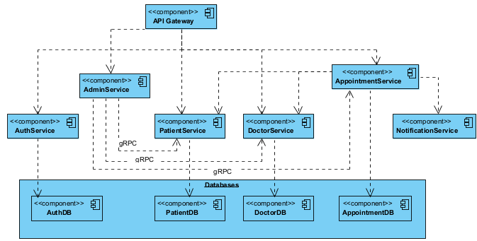

# 📊 Schedule an appointment for healthcare service - Analysis and Design

This document outlines the **analysis** and **design** process for your microservices-based system assignment. Use it to explain your thinking and architecture decisions.

---

## 1. 🎯 Problem 

The system must be analyzed and designed based on Service-Oriented Architecture (SOA), ensuring that the entire process—from booking an appointment, confirming the service and time, sending reminders, to managing changes or cancellations—is automated and user-friendly for patients and healthcare staff.

### Detauled Bunisness process steps:
1. Patient selects medical service and time: The patient accesses the system, selects the type of medical service (e.g., general check-up, specialist consultation, lab test), and chooses a convenient time slot.

2. Select healthcare doctor (if applicable): The system displays a list of available doctors, specialists, or medical staff for the selected service. The patient can choose their preferred doctor.
3. Check appointment availability: The system verifies the availability of the selected time and doctor. If unavailable, it suggests alternative times or doctors.
4. Confirm appointment: After the patient selects the time and doctor (if applicable), the system confirms the appointment details with the patient.
5. Send confirmation notification via email or SMS: The system sends a confirmation message to the patient via email or SMS, including details such as the service, date, time, location, and doctor’s name.
6. Update appointment in the system: The appointment is recorded in the healthcare system for tracking and management by medical staff.
7. Send reminders before the appointment: The system automatically sends reminders to the patient via email or SMS (e.g., 24 hours or 1 hour before the appointment).
8. Patient can modify the appointment (if needed): The patient can log into the system to adjust the appointment time, service, or doctor if necessary.
9. System checks and confirms changes: If modifications are made, the system checks availability and confirms the updated details with the patient.
10. Patient can cancel the appointment (if needed): If the patient cannot attend, they can cancel the appointment through the system.
11. Send cancellation notification to the doctor: Upon cancellation, the system notifies the healthcare doctor or staff about the canceled appointment.
12. Appointment tracking for medical staff: The system allows medical staff or administrators to monitor and manage appointment schedules daily, weekly, or monthly to optimize patient flow and resource allocation.
13. Complete service and collect feedback (optional): After the appointment, the patient may be prompted to provide feedback on the service or experience via the system.
14. Send invoice or payment information (optional): If the medical service incurs a fee, the system sends an invoice or payment details to the patient via email or SMS after the appointment.

### Actor: Patients, Doctors, Admin

### For patients:
- Book appointment from a calendar, each day in calendar will show avaiable doctors.
- View personal appointments.
- Manage personal appointments.

### For doctors:
- Doctor can assign daily/weekly, avaiable appointment slot.
- Manage schedules.
- Create, view, update patient records.

### For admins:
- Manage doctors, patients data.

### Data processed:
- Medical(patient) records
- Appointment schedules
- Dortor information
- Doctor availability
- Billing and payment information

## 2. 🧩 Microservices

### Service Breakdown

#### **1. Task Service**

Appointment Service

* **Purpose:** Manages the core appointment scheduling process.
* **Functions:**

  * Enables patients to select a time slot and healthcare doctor.
  * Verifies availability of the selected time and doctor.
  * Confirms appointments and processes modification or cancellation requests.
* **Interactions:**

  * Checks doctor availability via the **Doctor Service**.
  * Books or cancels slots using the **Scheduling Service**.
  * Sends notifications through the **Notification Service**.
* **Database:** MongoDB

#### **2. Entity Services**

Patient Service

* **Purpose:** Manages patient-related data.
* **Functions:**

  * Stores and updates patient details (e.g., name, contact info).
  * Maintains appointment history and status.
* **Interactions:**

  * Provides patient data to the **Appointment Service**.
* **Database:** MySQL

Doctor Service

* **Purpose:** Manages doctor-related data.
* **Functions:**

  * Stores doctor details (e.g., specialties, schedules).
  * Provides availability status.
* **Interactions:**

  * Queried by the **Appointment Service** for doctor availability.
* **Database:** MySQL

Scheduling Service

* **Purpose:** Manages appointment schedules.
* **Functions:**

  * Tracks and updates time slot availability.
  * Prevents scheduling conflicts.
* **Interactions:**

  * Used by the **Appointment Service** to book or cancel slots.
* **Database:** MongoDB

Admin Service

* **Purpose:** Oversees system operations and manages doctor/patient data.
* **Functions:**

  * Adds or removes doctors and patients from the system.
  * Manages roles and permissions.
  * Monitors system health and logs.
* **Interactions:**

  * Coordinates with Doctor Service and Patient Service for data updates.
  * May interact with all services for administrative oversight.
* **Database:** MySQL

#### **3. Micro Service**

Billing Service (Optional)

* **Purpose:** Handles financial transactions.
* **Functions:**

  * Generates invoices and processes payments.
  * Integrates with payment gateways if required.
* **Interactions:**

  * Triggered by the **Appointment Service** for payment-related tasks.
* **Database:** MySQL

---

#### **4. Utility Services**

Feedback Service (Optional)

* **Purpose:** Collects and analyzes patient feedback.
* **Functions:**

  * Sends feedback requests post-appointment.
  * Stores feedback for quality improvement.
* **Interactions:**

  * Called by the **Appointment Service** after appointments.
* **Database:** MySQL

Notification Service

* **Purpose:** Manages communication with users.
* **Functions:**

  * Sends confirmations, reminders, and cancellation notices via email or SMS.
* **Interactions:**

  * Used by the **Appointment Service** for all notifications.
* **Database:** None (uses SMTP/email service)

---

### API Gateway

* **Purpose:** Routes requests to services and manages centralized entry point.
* **Database:** N/A

---

Bạn có muốn mình gộp phần này vào toàn bộ tài liệu hệ thống để xuất file Markdown hoàn chỉnh không?

## 3. 🔄 Service Communication

- **Gateway ⇄ auth-service (REST)**: Handles user authentication and token validation.
- **Gateway ⇄ appointment-service (REST)**: Manages appointment-related requests.
- **Gateway ⇄ patient-service (REST)**: Retrieves and updates patient records.
- **Gateway ⇄ doctor-service (REST)**: Manages doctor profiles and schedules.
- **Gateway ⇄ admin-service (REST)**: Handles admin operations.
- **Internal: admin-service ⇄ patient-service, doctor-service, appointment-service (gRPC)**: Internal connection for admin operations.
- **Internal: appointment-service ⇄ notification-service (RabbitMQ)**: Sends asynchronous email notifications for appointment updates.
---
=======
## 4. 🗂️ Data Design

Describe how data is structured and stored in each service.

### auth-service (Django/MySQL):

- **User**:
  - `id`: UUID (primary key)
  - `email`: String (unique)
  - `password`: String (hashed)
  - `role`: Enum (patient, doctor, admin)
  - `created_at`: DateTime

### admin-service (Django/MySQL):

- **AdminActionLog**:
  - `id`: UUID
  - `admin_id`: UUID (references User)
  - `action`: String (e.g., "delete_user", "modify_appointment")
  - `details`: Text
  - `created_at`: DateTime

### patient-service (Django/MySQL):

- **Patient**:
  - `user_id`: UUID (references User)
  - `name`: String
  - `age`: Integer
  - `gender`: Enum (male, female, other)
  - `phone`: String
  - `medical_history`: Text

### doctor-service (Django/MySQL):

- **Doctor**:
  - `user_id`: UUID (references User)
  - `name`: String
  - `specialty`: String
  - `license`: String
  - `phone`: String
- **Schedule**:
  - `doctor_id`: UUID (references Doctor)
  - `day_of_week`: String
  - `time_slots`: JSON (e.g., \["09:00-10:00", "14:00-15:00"\])

### appointment-service (Django/MongoDB):

- **Appointment**:
  - `id`: UUID (primary key)
  - `patient_id`: UUID
  - `doctor_id`: UUID
  - `date`: Date
  - `time`: Time
  - `status`: Enum (pending, confirmed, cancelled)
  - `created_at`: DateTime

### billing-service (Django/Postgres):

- **Invoice**:
  - `id`: UUID
  - `appointment_id`: UUID
  - `amount`: Decimal
  - `status`: Enum (pending, paid, failed)
  - `created_at`: DateTime

### notification-service (Nginx/Django):

- **NotificationLog** (optional, in-memory or external DB):
  - `id`: UUID
  - `recipient`: String (email)
  - `type`: Enum (email)
  - `content`: Text
  - `status`: Enum (sent, failed)
  - `sent_at`: DateTime

Use diagrams if possible (DB schema, ERD, etc.)

---

## 5. 🔐 Security Considerations

- Use JWT for user sessions
- Validate input on each service
- Role-based access control
  -  Patients can only see their records.
  -  Doctors can only see their patients' data.
  -  Admins can manage all users and services.
- Encrypt senstive patient data
---

## 6. 📦 Deployment Plan

- Use `docker-compose` to manage local environment
- Each service has its own Dockerfile
- Environment config stored in `.env` file

---

## 7. 🎨 Architecture Diagram

> Architecture diagram
 

---

## ✅ Summary

Summarize why this architecture is suitable for your use case, how it scales, and how it supports independent development and deployment.

## Author

This template was created by Hung Dang.

- Email: hungdn@ptit.edu.vn
- GitHub: hungdn1701

Good luck! 💪🚀
