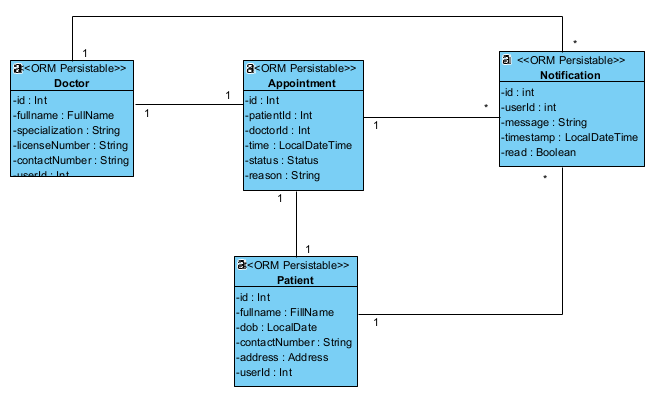
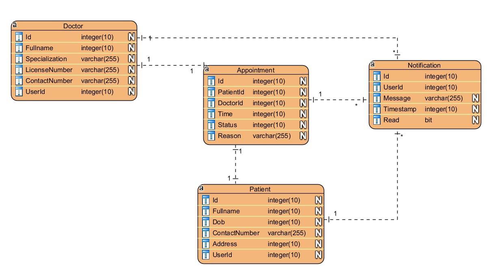

# System Architecture

## Overview

The "Schedule an Appointment" module is a key component of the microservices-based healthcare system, designed to facilitate seamless appointment booking between patients and doctors. 

This module allows patients to schedule appointments for services via an application or website. Patients can select the time, service type, and service provider (dotors). Once an appointment is booked, the system will comform and notify the customer and send reminders.

The main components include:
## Task Service:
- **appointment-service**: Handles appointment creation and management.Checking avaiability, confirming appointments.

## Entity Services:
- **patient-service**: Manages patient profiles and booking history.
- **doctor-service**: Manages doctor profiles and schedules.
- **admin-service**: Manages administrative tasks, including user and appointment oversight.
- **scheduling-service**: Manages schedules for both patients and employees, ensuring proper checking and handling of appointmentavaiability.
## Utility Service
- **api-gateway**: Routes requests.
- **auth-service**: Manages user authentication and authorization.
- **notification-service**: Sends email notifications.

## System Components

- **auth-service**:

  - **Functionality**: Handles user authentication and authorization using JWT tokens.
  - **Role**: Ensures secure access to the system and provides user identity for other services.
  - **Tech Stack**: Django/MySQL

- **admin-service**:

  - **Functionality**: Oversees system operations and manages doctor/patient data (e.g., create, update, delete users, monitor appointments).
  - **Role**: Enables admins to control the system, ensuring operational efficiency.
  - **Tech Stack**: Django/MySQL

- **patient-service**:

  - **Functionality**: Manages patient profiles, including personal details and medical history.
  - **Role**: Stores and retrieves patient data for appointment booking and doctor consultations.
  - **Tech Stack**: Django/MySQL

- **doctor-service**:

  - **Functionality**: Manages doctor profiles and their work schedules (e.g., available time slots).
  - **Role**: Provides doctor availability and details for appointment scheduling.
  - **Tech Stack**: Django/MySQL

- **appointment-service**:

  - **Functionality**: Manages booking, viewing, updating, and canceling schedules.
  - **Role**: Core service for the appointment booking workflow, coordinating between patients and doctors.
  - **Tech Stack**: Django/MongoDB

- **notification-service**:

  - **Functionality**: Sends notifications through email for appointment updates or confirmations.
  - **Role**: Enhances user experience by keeping patients and doctors informed.
  - **Tech Stack**: Nginx/Django

- **api-gateway**:

  - **Functionality**: Routes requests to appropriate services, validates JWT tokens, and balances load.
  - **Role**: Simplifies client interactions, enforces security, and abstracts service complexity.
  - **Tech Stack**: Nginx/Django

## Communication

- **Service Interaction**:
  - **Synchronous**: Services communicate via REST APIs over HTTP. For example, the appointment-service queries the doctor-service to validate available time slots.
  - **Asynchronous**: The notification-service uses a message queue (e.g., RabbitMQ) to process email notifications, triggered by events (e.g., appointment creation).
- **Internal Networking**:
  - Docker Compose assigns service names (e.g., `auth-service`, `api-gateway`) for internal communication.
  - Services resolve each other using these names (e.g., `http://doctor-service:8003` for doctor-service API calls).
  - The gateway-service forwards external requests to internal service endpoints.

## Data Flow

1. **Client Request**:
   - Clients (web/mobile) send requests to the gateway-service (`http://gateway:8000`).
   - The gateway-service validates JWT tokens (via auth-service) and routes requests to the appropriate service.
2. **Authentication**:
   - Users register or log in via `POST /auth/register` or `POST /auth/login` (auth-service).
   - The auth-service returns a JWT token, which is included in subsequent requests.
3. **Appointment Booking**:
   - Patients query doctor schedules (`GET /doctors/{id}/schedules` via doctor-service).
   - Patients book appointments (`POST /appointments` via appointment-service).
   - Appointment-service validates doctor availability (doctor-service) and patient data (patient-service).
4. **Administrative Tasks**:
   - Admins manage users (`POST /admin/users`, `DELETE /admin/users/{id}` via admin-service).
   - Admins view or modify appointments (`GET /admin/appointments`, `PUT /admin/appointments/{id}` via admin-service).
   - Admin-service interacts with auth-service, patient-service, doctor-service, and appointment-service to retrieve or update data.
5. **Notifications**:
   - Appointment creation/update or admin actions trigger messages to notification service (upgrade to RabbitMQ in the future).
   - Notification-service consumes messages and sends emails via an external SMTP server.
6. **External Dependencies**:
   - **Databases**: MySQL (auth-service, admin-service, patient-service, doctor-service), MongoDB (appointment-service).
   - **RabbitMQ**: Message queue for notification-service.
   - **Third-party APIs**: SMTP server (e.g., SendGrid) for emails.

## Diagram

Overall architecture diagram::

Class diagram:

Database schema:

## Scalability & Fault Tolerance

- **Scalability**:
  - Each microservice can be scaled independently by adding Docker containers (e.g., multiple `appointment-service` instances for high booking demand).
  - Nginx in the gateway-service balances load across service instances.
  - Databases can use read replicas (MySQL, Postgres) or sharding (MongoDB) for scalability.
- **Fault Tolerance**:
  - Separate databases per service ensure a failure in one service (e.g., patient, doctor) does not affect others (e.g., appointment-service).
  - RabbitMQ ensures reliable message delivery for notifications, with retry mechanisms.
  - Docker Compose health checks monitor service availability, restarting unhealthy containers.
